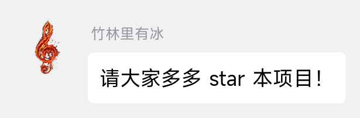
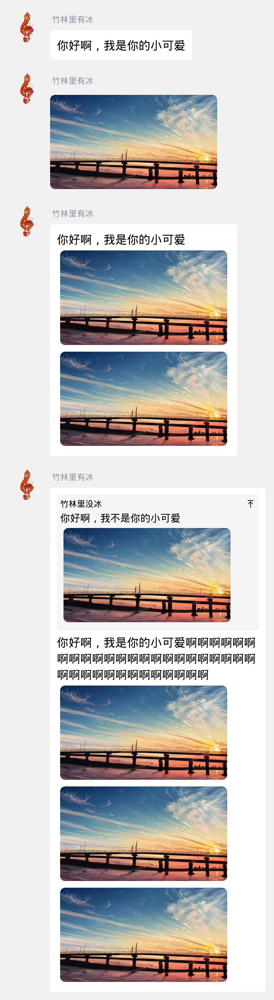
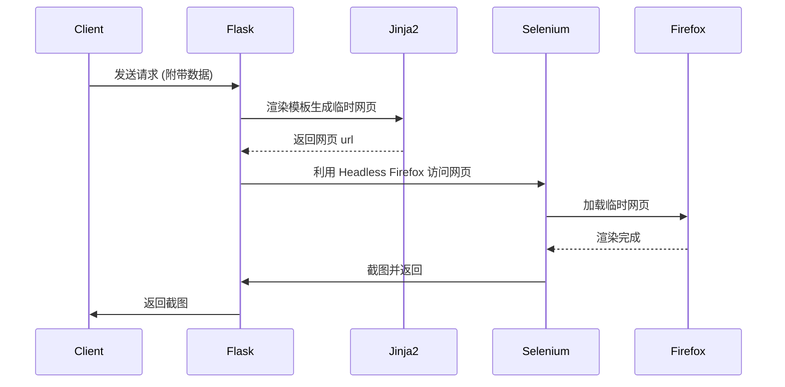

# qq-quote-generator

一个基于 headless firefox 实现的低性能 qq 聊天语录图片生成 api，灵感来源于 telegram 的 [quote-bot](https://github.com/LyoSU/quote-bot)。



## Quick Start

### Docker

```bash
docker run -d \
  --name qq-quote-generator \
  --restart unless-stopped \
  -p 5000:5000 \
  zhullyb/qq-quote-generator
```

### 请求示例

```bash
curl -X POST http://127.0.0.1:5000/png \
  -H "Content-Type: application/json" \
  -d '[{"user_id": 5435486,"user_nickname": "竹林里有冰","message": "请大家多多 star 本项目！"}]' \
  -o demo.png 
```

## 更多样式

qq-quote-generator 针对纯文本、纯图片、图片+文本（或多图片）三种类型的消息做了不同的样式处理，且支持在一张图上连续生成多条消息以求达到更好的模拟效果。生成如下示例图的的 json 字段可参考 [data_example.json](./assets/data_example.json)。

传入的图片链接可以是能够被 Firefox 访问的公开图床，也可以是图片的 base64 编码，只需要能够被浏览器的 `` 标签所识别即可。



## 工作原理



## Breaking Change:

- 0.0.7:
  - 将请求路径移至 /png/ 及 /base64/ 用以区分返回类型，/ 路径被弃用
